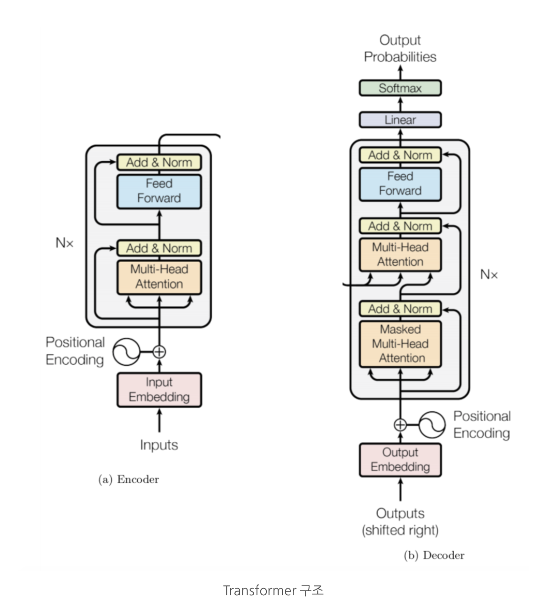

## NLP의 ImageNet 시기

[NLP's ImageNet moment has arrived](https://thegradient.pub/nlp-imagenet/) 

2018년에 NLP의 모델들에 큰 변화가 생겼는데 위의 글이 이 변화를 잘 설명해준다. 글에서는 "NLP의 ImageNet 시기"가 오게 되었다고 하는데, 이로 인해 이제 우리는 훈련된 모델을 다운로드 받아 조금의 튜닝만 해서 우리 문제를 해결하는데 사용할 수 있다. 이해한 내용을 짧게 설명해보겠다.

NLP에서는 그 동안 단어 벡터를 사전학습(pretrain)하는 방법을 사용했는데, word2vec이나 GloVe로 훈련된 벡터들은 신경망의 첫번째 레이어에만 사용되고 나머지는 해결하고자하는 문제에 맞는 데이터를 사용해 훈련되었다. 이런 피상적인 접근방법은 CV(Computer Vision)에서 edge만 묘사할 수 있는 것과 비슷하다. high-level 정보를 담지 못한다는 것이다. 그렇기 때문에 단어 벡터를 사용한 모델들은 sequence에서의 단어 의미 등과 같은 정보들을 처음부터 학습해야한다. 그렇기 때문에 데이터 양이 굉장히 많아야 좋은 성능을 낼 수 있다.

하지만 ULMFiT, ELMO과 같은 모델들은 모델의 첫 레이어만 사용하는 방식이 아니라 전체 모델을 hierarchical representation으로 나타낸다. high-level의 의미 정보까지 나타내는 것이다. 이렇게 low, high feature를 모두 배우도록 전체 모델을 트레이닝하는 것은 CV에서 자주 사용되던 방식이다. 대표적으로 ImageNet 데이터셋의 수많은 이미지를 분류할 때 사용이 되었고, 이제 NLP에도 이러한 접근이 사용되며 ImageNet for language가 시작되었다고 한다.

ImageNet 데이터셋을 통해 훈련된 가중치들은 다른 데이터셋을 초기화할 때 사용되어 성능을 높일 수 있다. 이는 ImageNet 이 충분히 큰 데이터셋이고(수만개 이상), 훈련의 problem space를 대표하기 때문이라고 볼 수 있다. 그럼 언어를 모델링 할 때 ImageNet과 같은 특징을 보이는 모델이 있는지 살펴보자. Reading comprehension(예- SQuAD), Natural language inference(예- SNLI), Machine translation, Constituency parsing, Language Modeling 등 다양한 문제들이 존재한다. 그럼 이중에 어떤 문제를 해결하는 모델이 NLP의 problem space를 가장 대표할 수 있을까?

현재까지는 Language Modeling(LM)이 그 답으로 보인다. Language Modeling은 이전 단어가 주어졌을 때 다음 단어를 예측하는 것이 해결하고자하는 문제이다. 이를 하기 위해서는 모델이 구문(syntax) 뿐만 아니라 의미(semantic)까지 알아야하며 더 나아가 인간의 '상식'까지 가지고 있어야한다. 특히 이러한 LM 문제의 데이터는 언어에 관계없이 쉽게 구할 수 있다는 장점도 있다. 실제로 ELMo, ULMFiT, OpenAI Transformer 등의 모델이 모두 LM을 사용해서 훈련을 한 모델이고 좋은 성능을 보였다.

이제 훈련된 단어 임베딩이 아닌 훈련된 language model을 사용하는 전이 학습의 시대가 왔다.

   

## BERT 모델의 대표적인 특징 

위에 말한 모델들은 대용량 unlabeled corpus를 사용해서 Language Model을 학습하고 그 뒤에 해결하고자 하는 문제에 맞게 네트워크를 붙이는 접근을 하고 있다. 위 모델들 이후에 나온 BERT도 이와 비슷한 접근인데 1) Bidirectional 하고 네트워크를 뒤에 붙이는 것이 아니라 2) 모델 자체를 fine-tuning 한다는 점에서 다르다.

BERT는 Bidirectional Encoder Representations from Transformers의 약자이다. 이름에도 드러나듯 Bidirectional하다는 것과 Transformer를 사용했다는 것은 BERT의 주요한 특징이다. 모델을 자세히 분석하기 전에 이 두 특징을 알아보자.

- Transformers

Transformer 구조는 “Attention is all you need(Vaswani et al., 2017)”(arxiv) 에서 소개한 구조이다. BERT는 이 Transformer 구조를 활용했다. Transformer는 인코더와 디코더로 나뉘어지는데 BERT 그 중에서도 인코더 부분만 사용하는 모델이다. 다음 글에 Transformer 구조에 대해 자세하게 다뤄볼 예정이지만 간략하게 먼저 소개해보겠다.

Transfomer는 문장을 다른 언어로 번역하는 것을 목표로 한다. 이를 하기 위해선 모델이 input 문장의 단어들 사이의 관계를 이해하고 Input 문장과 각 단계에서 이미 번역된 단어들에 대한 정보를 합칠 수 있어야 한다. Transformer의 인코더 부분은 먼저 인풋 문장(번역 전 문장)의 각 단어들에 대한 정보를 합쳐준다. 디코더에서는 인코더의 아웃풋과 target 문장(번역 후 문장)의 정보과 합쳐준다.

 

- Bidirectional

BERT의 self-attention 레이어는 양방향으로 작동한다. 이는 "I love to work on NLP" 라는 문장이 있을 때 OpenAI GPT는 love 토큰이 I와 자기자신과의 self-attention만을 수행하는데 반해 BERT는 다른 모든 토큰과 수행한다는 의미이다. Transformer 인코더는 bidirectional한데 왜 OpenAI GPT는 그렇지 않았을까?

OpenAI GPT는 위에서 언급했듯이 주어진 단어들로부터 다음 등장 단어의 확률을 예측하는 Language Model(LM)모델이다. transformer 인코더를 각 토큰에 대해 다음 단어가 무엇일지에 대해 훈련한 것이다. 그렇기 때문에 bidirectional self-attention을 수행한다고 하면 모델은 이미 다음 단어를 아는 상태이기 때문에 100%의 정확도로 예측을 할 것이다. 결국 훈련을 통해 모델이 의미있는 정보를 얻지 못하는 것이다. 원래 Transformer는 앞서 언급했듯 번역하는 문제를 해결하도록 훈련되었다. 인코더와 디코더가 따로 존재해서 인코더의 input token은 영어 문장의 토큰들이었고 예측 결과인 다른 언어의 문장은 mask되었기 때문에 bidirectional self-attention이 수행될 수 있었다.

앞서 설명하였듯 LM의 훈련을 위해 transformer 인코더를 사용하면서 bidirectionality를 사용할 수는 없다. 그러면 BERT에서는 bidirectionality를 어떻게 수행했을까? BERT는 LM이 아닌 Masked Language Model과 Next Sentence Prediction으로 모델을 훈련시켰다.

Masked Language Model은 문장내 랜덤 단어를 마스킹하고 이를 예측하는 방식이고, Next Sentence Prediction은 두 문장이 있을 때 두번째 문장이 첫번째 문장 바로 다음에 오는지 예측하도록 하는 방식이다.  

-------
  

### 참고

https://medium.com/@mromerocalvo/dissecting-bert-part1-6dcf5360b07f

https://medium.com/dissecting-bert/dissecting-bert-part2-335ff2ed9c73

http://docs.likejazz.com/bert/#모델

https://mino-park7.github.io/nlp/2018/12/12/bert-논문정리/?fbclid=IwAR3S-8iLWEVG6FGUVxoYdwQyA-zG0GpOUzVEsFBd0ARFg4eFXqCyGLznu7w
